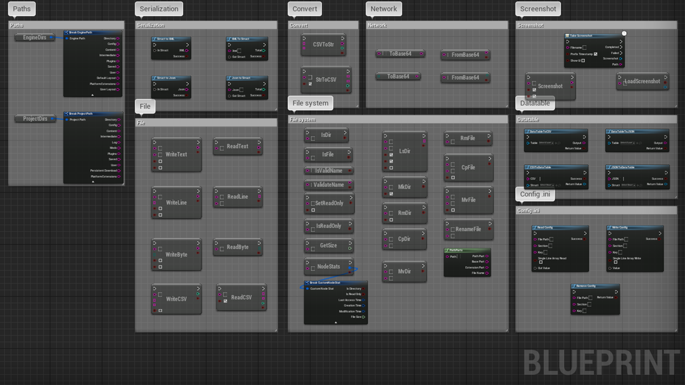
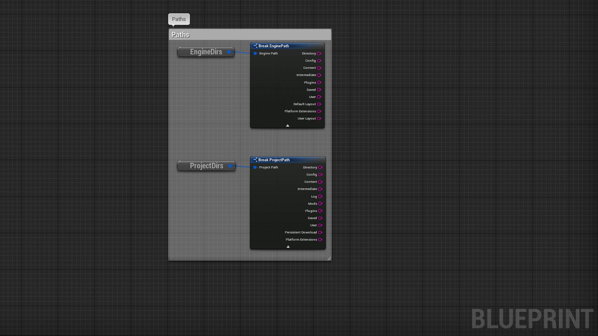
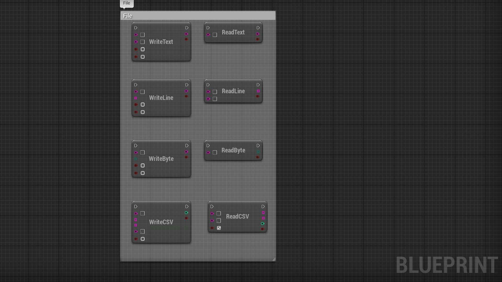
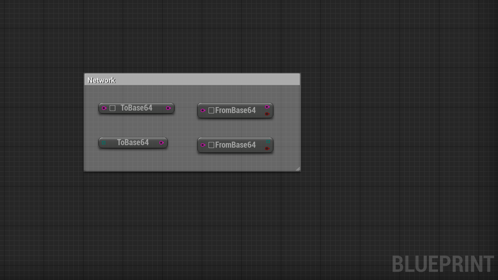
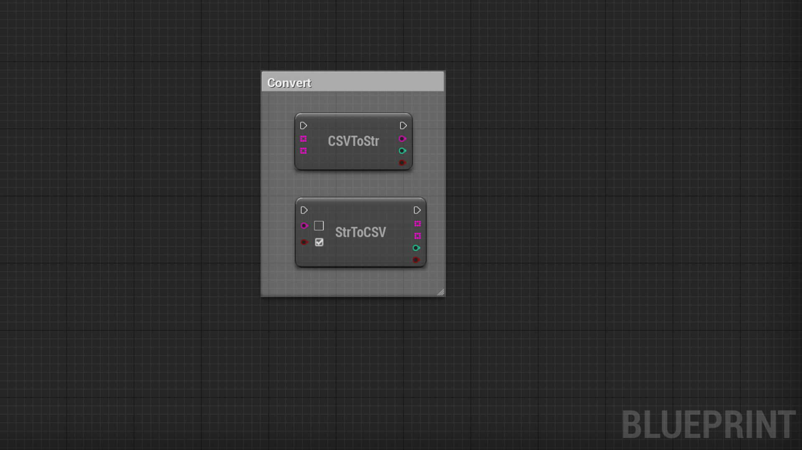
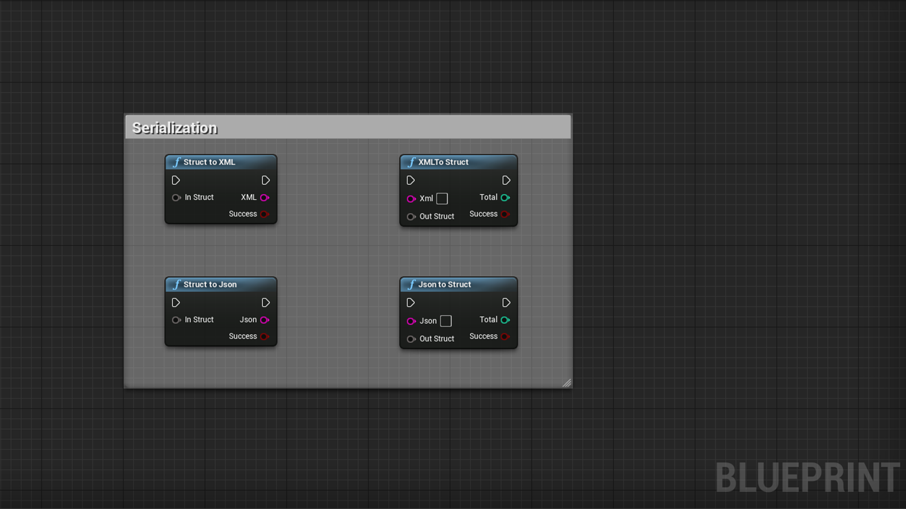
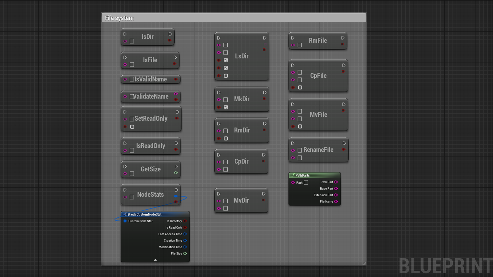
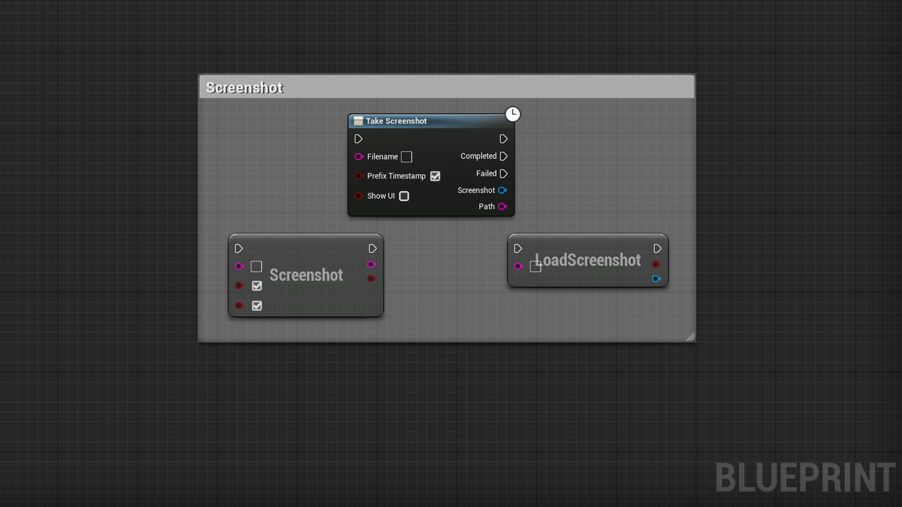
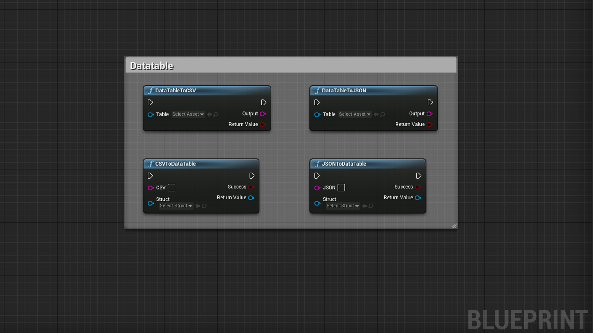
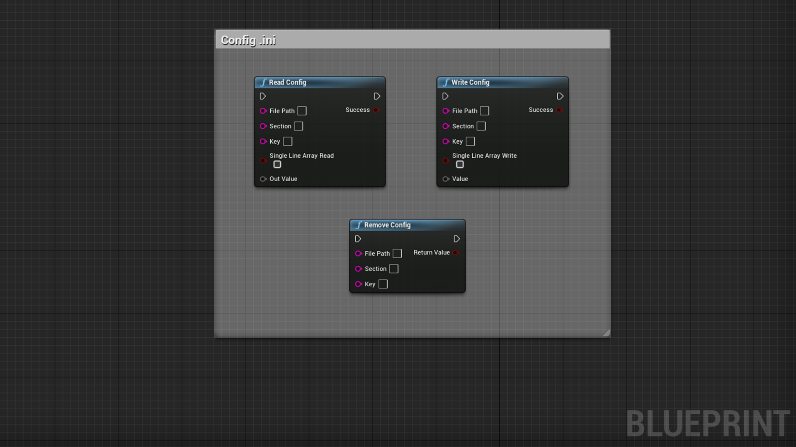

# FileHelper

- UE4 Plugin to handle files operations
- This is a blueprint library plugin
- It exposes 50+ functions to handle various files format and file system operations
- Allows you to easily serialize a custom struct to JSON / XML and deserialize it back to a struct
- Allows you to read/write .ini configuration files
- Allows you to export/import a datatable from/to Json or CSV
- Take screenshots and load them into textures
- Can be used in any blueprint

 

[Link to the plugin in the marketplace](https://www.unrealengine.com/marketplace/en-US/product/bec5be3d587f4ff49a61d45d0e81e4c0)

# Documentation

 

# Paths

| Node | Inputs | Outputs | Note |
| ---- | ------ | ------- | ---- |
| GetEngineDirectories | void | Struct(FEnginePath) | Returns all the engine related paths |
| GetProjectDirectories | void | Struct(FProjectPath) | Returns all the project related paths |

 

# Files

    Note: Be carefull using these nodes, you are accessing the file system of the user's computer, ensure your code is working as intended before shipping

| Node | Inputs | Outputs | Note |
| ---- | ------ | ------- | ---- |
| ReadTextFile | Path(String) | Success(Bool), Output(String) | Reads the whole content of a text file |
| WriteTextFile | Path(String), Content(String), Append(Bool), Force(Bool) | Success(Bool), Error(Text) | Writes text content into a file |
| ReadLineFile | Path(String), Pattern(String) | Success(Bool), Output(Array(String)) | Reads lines of a file, if you specify a pattern (regex), reads only the lines that matches this pattern |
| WriteLineFile | Path(String), Content(Array(String)), Append(Bool), Force(Bool) | Success(Bool), Error(Text) | Writes lines into a file |
| ReadByteFile | Path(String) | Success(Bool), Output(Array(Byte)) | Reads binary content from a file |
| WriteByteFile | Path(String), Content(Array(Byte)), Append(Bool), Force(Bool) | Success(Bool), Error(Text) | Writes binary content to a file |
| WriteCSVFile | Path(String), Headers(Array(String)), Data(Array(String)), Force(Bool) | Success(Bool), Total(Int) | Writes csv headers and datas to a file, delimiter will be , |
| ReadCSVFile | Path(String), HeaderFirst(Bool) | Success(Bool), Headers(Array(String)), Data(Array(String)), Total(Int) | Reads csv headers and data from a file, delimiter must be , |

 

# Network

These nodes allows you to encode/decode content from/to base64

    Note: These nodes can be useful to send content on the network (image,text, file)

| Node | Inputs | Outputs | Note |
| ---- | ------ | ------- | ---- |
| StrToBase64 | Source(String) | Result(String) | Encodes a string to a base64 string |
| StrFromBase64 | Base64Str(String) | Success(Bool), Result(String) | Decodes a string from a base64 string |
| BytesToBase64 | Source(Array(Byte)) | Result(String) | Encodes a binary content to a base64 string |
| BytesFromBase64 | Base64Str(String) | Success(Bool), Result(Array(Byte)) | Decodes a binary content from a base64 string |
 
 

# CSV
 

| Node | Inputs | Outputs | Note |
| ---- | ------ | ------- | ---- |
| StringToCSV | Content(String), HeaderFirst(Bool) | Success(Bool), Headers(Array(String)), Data(Array(String)), Total(Int) | Extracts headers, data from csv string, delimiter must be , |
| CSVToString | Headers(Array(String)), Data(Array(String)) | Success(Bool), Result(String), Total(Int) | Converts headers, data array into a csv string, delimiter will be , |

 

# Serialization

    Do not use fields with withespaces or special characters in your structures, they will get serialized but you won't be able to deserialize them !

    Note v1.2 : You can now provide (map, array, set, object, struct) and it will get (de)serialized, do not use scalar types like string, numeric, boolean...
    
    Note v1.1 and minor : Please provide only struct (not array of struct, not map of struct, not set of struct) to these functions, you can put maps, sets, array in the struct you wish to export, it will work, you can also put any other object, it will get serialized and when deserializing the object will be created and available as expected

| Node | Inputs | Outputs | Note |
| ---- | ------ | ------- | ---- |
| StructToXML | InStruct(AnyStruct) | Success(Bool), Xml(String) |  Converts any type of struct into XML string |
| XMLToStruct | Xml(String), OutStruct(AnyStruct) | Success(Bool) | Converts an XML string back into the input struct provided, returns whether the parsing was successful carried |
| StructToJson | InStruct(AnyStruct) | Success(Bool), Json(String) | Converts any type of struct into JSON string |
| JsonToStruct | Json(String), OutStruct(AnyStruct) | Success(Bool) | Converts a json string back into the input struct provided, returns whether the parsing was successful carried |

 

# File system

    Note: Be carefull using these nodes, you are accessing the file system of the user's computer, ensure your code is working as intended before shipping

| Node | Inputs | Outputs | Note |
| ---- | ------ | ------- | ---- |
| IsFile | Path(String) | Success(Bool) | Checks whether a path is a valid file |
| IsDirectory | Path(String) | Success(Bool) | Checks whether a path is a valid directory |
| IsValidFilename | Filename(String) | Success(Bool) | Checks whether a filename is valid and can be used on this file system, do not hit the disk |
| ValidateFilename | Filename(String) | Result(Bool), ValidName(String) | Sanitizes a filename to be used on the file system, do not hit the disk |
| SetReadOnlyFlag | Path(String), Flag(Bool) | Result(Bool) | Sets the read only property on a file, if the file system supports it |
| GetReadOnlyFlag | Path(String) | Result(Bool) | Gets the read only property on a file, if the file system supports it |
| GetFileSize | Path(String) | Size(Int64) | Gets the size of a file on the file system in bytes |
| ListDirectory | Path(String), Pattern(String), ShowFile(Bool), ShowDirectory(Bool), Recursive(Bool) | Result(Bool), Nodes(Array(String)) | Lists all nodes on that path, file or directory, if pattern (regex) is not empty, returns only the one that matches it, can search recursively |
| MakeDirectory | Path(String), Recursive(Bool) | Result(Bool) | Creates new directory, can work recursively |
| RemoveDirectory | Path(String), Recursive(Bool) | Result(Bool) | Removes a directory, if it is not empty, check the recursive option |
| CopyDirectory | Source(String), Dest(String) | Result(Bool) | Copies the content of a directory to a destination path, overwrites existing content |
| MoveDirectory | Source(String), Dest(String) | Result(Bool) | Moves the content of a directory to a destination path, overwrites existing content |
| NodeStats | Path(String) | Result(Bool), Stats(FCustomNodeStat) | Returns the stats of a node if it exists |
| RemoveFile | Path(String) | Result(Bool) | Removes a file from the file system |
| CopyFile | Source(String), Dest(String), Force(Bool) | Result(Bool) | Copies a file to a destination path |
| MoveFile | Source(String), Dest(String), Force(Bool) | Result(Bool) | Moves a file to a destination path |
| RenameFile | Path(String), Name(String) | Result(Bool) | Renames a file |
| PathParts | Path(String) | PathPart(String), BasePart(String), ExtensionPart(String), Filename(String) | Returns the different parts of path, do not hit the disk |

 

# Screenshot

| Node | Inputs | Outputs | Note |
| ---- | ------ | ------- | ---- |
| TakeScreenShot | Filename(String), PrefixTimestamp(Bool), ShowUI(Bool) | Result(Bool), Path(String) | Take a screenshot from current the view and saves it in the default screenshot folder and return the path |
| LoadScreenShot | Path(String) | Result(Bool), Screenshot(Texture2D) | Loads a screenshot from a path into a Texture2D, do not use this right after takescreenshot because the file might not be already written on disk, use the async node following |
| TakeScreenshot | Filename(String), PrefixTimestamp(Bool), ShowUI(Bool) | OnCompleted(Texture2D, String), OnFailed() | Async node to take screenshot and return a texture with the actual screenshot and path on completion |

 

# Datatable

    Note: You need to know the correct row struct in order to reimport the datatable content correctly

    Do not use fields with withespaces or special characters in your structures, they will get exported but you won't be able to import them back !

| Node | Inputs | Outputs | Note |
| ---- | ------ | ------- | ---- |
| DataTableToCSV | Table(DataTable) | Result(Bool), Output(String) | Converts a datatable to csv string |
| CSVToDataTable | Input(String), RowStruct(AnyStruct) | Result(Bool), Table(DataTable) | Converts a csv string to datatable using the specified struct as row model | 
| DataTableToJSON | Table(DataTable) | Result(Bool), Output(String) | Converts a datatable to json string |
| JSONToDataTable | Input(String), RowStruct(AnyStruct) | Result(Bool), Table(DataTable) | Converts a json string to datatable using the specified struct as row model |

 

# Config

    Note: These nodes helps to read/write configuration files (*.ini), you can pass the following variables to these function (Bool, Int, Double, Float, String, Array(String), Rotator, Vector, LinearColor, Vector4, Vector2D) anything else will fail, keep in mind that a restart of the engine/game is needed for these changes to be taken into account !

| Node | Inputs | Outputs | Note |
| ---- | ------ | ------- | ---- |
| ReadConfig | Filepath(String), Section(String), Key(String), SingleLineArrayRead(Bool), OutValue(AnyStruct) | Result(Bool) | Reads a config file and extracts the section->key value into OutValue (can be any type mentionned earlier), check SingleLineArrayRead if you know the value is an array on a single line in the file else uncheck it |
| WriteConfig | Filepath(String), Section(String), Key(String), SingleLineArrayWrite(Bool), Value(AnyStruct) | Result(Bool) | Write a config file value at the section->key, creates the file if not found, check SingleLineArrayWrite to write an array on a single line instead of multiple lines |
| RemoveCongig | Filepath(String), Section(String), Key(String) | Result(Bool) | Removes the value associated with section->key in the file |