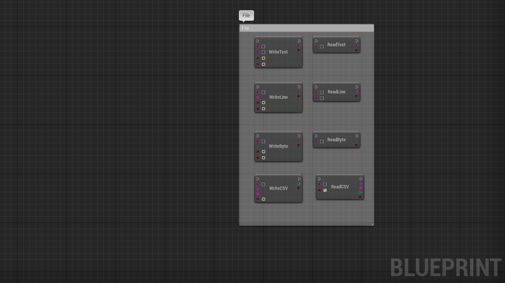

# FileHelper

 

# About

- UE plugin handling files operations on various platforms 
- Handle text/binary files on the local file system
- Allows you to read/write .ini configuration files and cache memory
- Allows you to export/import a datatable from/to JSON or CSV
- Allows to take screenshots, save and load them into textures
- It exposes easy to use blueprint functions to handle files in your project

 

# Setup

1. [Get the plugin on the marketplace](https://www.unrealengine.com/marketplace/en-US/product/file-helper-bp-library) and install the plugin for the engine version you wish to use
2. Create or open an unreal engine project with a supported version
3. In the editor, go to Edit/Plugins, search for the plugin, check the box to enable it and restart the editor
4. When a new plugin version is available, go to your Epic Games Launcher, under Unreal Engine/Library, below the engine version, you will find your installed plugins, find the plugin and click on update, then wait for it to finish and restart your editor

 

# Support

### Bugs/Issues

If you encounter issues with this plugin, you **should** report it, to do so, in the editor, go to Edit/Plugins, search for this plugin, click on the plugin support button, this will open your browser and navigate to the plugin issue form where you need to fill in all the relevant details about your issue, this will help me investigate and reproduce it on my own in order to fix it. Be precise and give as many details as you can. Once solved, a new plugin version will be submitted to the marketplace, update the plugin and you are good to go. **Due to epic marketplace limitations, I can only patch/update this plugin for the last 3 engine version, older engine versions will not be supported anymore.**

### Feature requests

If you want a new feature relevant to this plugin use case, you can submit a request in the [plugin marketplace question page](https://www.unrealengine.com/marketplace/en-US/product/file-helper-bp-library/questions). I **may** add this new feature in a future plugin version.

 

# Documentation

_Screenshots may differ from the latest plugin version, some features may have evolved or have been removed if deprecated._

 

### Path

_Get the relevant folder path for the engine and project_

**FProjectPath** is a struct used to read all the project absolute related paths like Directory, Config, Content, Intermediate, Log, Mods, Plugins, Saved, User, PersistentDownload, PlatformExtensions

**FEnginePath** is a struct used to read all the engine absolute related paths like Directory, Config, Content, Intermediate, Plugins, Saved, User, DefaultLayout, PlatformExtensions, UserLayout

| Node | Inputs | Outputs | Note |
| ---- | ------ | ------- | ---- |
| GetEngineDirectories | void | Struct(FEnginePath) | Returns all the engine absolute related paths |
| GetProjectDirectories | void | Struct(FProjectPath) | Returns all the project absolute related paths |

 

### File IO

_Be carefull using these nodes, you are accessing the file system of the user's computer, ensure your code is working as intended before shipping_

_Make sure you have asked the user permission to access their file system, on some OS read/write restrictions might occur_

| Node | Inputs | Outputs | Note |
| ---- | ------ | ------- | ---- |
| ReadTextFile | Path(String) | Success(Bool), Output(String) | Reads the whole content of a text file if it exists |
| WriteTextFile | Path(String), Text(String), Append(Bool), Force(Bool) | Success(Bool), Error(String) | Writes text content into a file, creates the file when not found or appends to it if it exists, you can force to overwrite it |
| ReadLineFile | Path(String), Pattern(String) | Success(Bool), Lines(Array(String)) | Reads lines of a file if it exists, if you specify a regex pattern, reads only the lines that matches this pattern |
| ReadLineRangeFile | Path(String), StartIndex(Int), EndIndex(Int) | Success(Bool), Lines(Array(String)) | Reads lines of a file if it exists, if you specify a range, reads only the lines between the range |
| WriteLineFile | Path(String), Text(Array(String)), Append(Bool), Force(Bool) | Success(Bool), Error(String) | Writes lines into a file, creates the file when not found or appends to it if it exists, you can force to overwrite it |
| ReadByteFile | Path(String) | Success(Bool), Bytes(Array(Byte)) | Reads binary content of a file if it exists |
| WriteByteFile | Path(String), Bytes(Array(Byte)), Append(Bool), Force(Bool) | Success(Bool), Error(String) | Writes binary content to a file, creates the file when not found or appends to it if it exists, you can force to overwrite it |
| WriteCSVFile | Path(String), Headers(Array(String)), Data(Array(String)), Force(Bool) | Success(Bool), Total(Int) | Writes csv header and body to a text file, delimiter will be ',', creates the file when not found, you can force to overwrite it |
| ReadCSVFile | Path(String), HeaderFirst(Bool) | Success(Bool), Headers(Array(String)), Data(Array(String)), Total(Int) | Reads csv header and body from a text file if it exists, delimiter must be ',' |

 

### File System

_Be carefull using these nodes, you are accessing the file system of the user's computer, ensure your code is working as intended before shipping_

_Make sure you have asked the user permission to access their file system, on some OS read/write restrictions might occur_

**FCustomNodeStat** is a struct used to read file system node informations like IsDirectory, IsReadOnly, CreationTime, ModificationTime, LastAccessTime, FileSize

| Node | Inputs | Outputs | Note |
| ---- | ------ | ------- | ---- |
| IsFile | Path(String) | Success(Bool) | Checks whether a path points to a valid file |
| IsDirectory | Path(String) | Success(Bool) | Checks whether a path points to a valid directory |
| IsValidFilename | Filename(String) | Success(Bool) | Checks whether a filename is valid and can be used on this file system, does not hit the disk |
| IsValidPath | Path(String) | Success(Bool) | Checks whether a path is valid and can be used on this file system, does not hit the disk |
| ValidateFilename | Filename(String) | Result(Bool), ValidName(String) | Sanitizes a filename to be used on the file system, does not hit the disk |
| SetReadOnlyFlag | Path(String), Flag(Bool) | Result(Bool) | Sets the read only property on a file, if the file system supports it |
| GetReadOnlyFlag | Path(String) | Result(Bool) | Gets the read only property on a file, if the file system supports it |
| GetFileSize | Path(String) | Size(Int64) | Gets the size in bytes of a file on the file system |
| ListDirectory | Path(String), Pattern(String), ShowFile(Bool), ShowDirectory(Bool), Recursive(Bool) | Result(Bool), Nodes(Array(String)) | Lists all nodes on that path, file or directory, if pattern (regex) is not empty, returns only the one that matches it, can search recursively |
| MakeDirectory | Path(String), Recursive(Bool) | Result(Bool) | Creates new directory, can work recursively to create a directory tree |
| RemoveDirectory | Path(String), Recursive(Bool) | Result(Bool) | Removes a directory, if it is not empty then check the recursive option |
| CopyDirectory | Source(String), Dest(String) | Result(Bool) | Copies the content of a directory to a new destination, overwrites existing content |
| MoveDirectory | Source(String), Dest(String) | Result(Bool) | Moves the content of a directory to a new destination, overwrites existing content |
| NodeStats | Path(String) | Result(Bool), Stats(FCustomNodeStat) | Returns information about an existing node |
| RemoveFile | Path(String) | Result(Bool) | Removes a file from the file system if it exists |
| CopyFile | Source(String), Dest(String), Force(Bool) | Result(Bool) | Copies a file to a new destination |
| MoveFile | Source(String), Dest(String), Force(Bool) | Result(Bool) | Moves a file to a new destination |
| RenameFile | Path(String), NewName(String) | Result(Bool) | Renames an existing file |
| PathParts | Path(String) | PathPart(String), BasePart(String), ExtensionPart(String), Filename(String) | Returns the different parts of path, does not hit the disk |

 

### Network

_These nodes allows you to encode/decode content to send it on the network (image,text,file)_

| Node | Inputs | Outputs | Note |
| ---- | ------ | ------- | ---- |
| BytesToBase64 | Bytes(Array(Byte)) | Result(String) | Encodes binary data into a base64 string |
| BytesFromBase64 | Source(String) | Success(Bool), Out(Array(Byte)) | Decodes a base64 string into binary data |
 
 

### CSV
 

| Node | Inputs | Outputs | Note |
| ---- | ------ | ------- | ---- |
| StringToCSV | Content(String), HeaderFirst(Bool) | Success(Bool), Headers(Array(String)), Data(Array(String)), Total(Int) | Extracts header, body from csv string, delimiter must be ',' |
| CSVToString | Headers(Array(String)), Data(Array(String)) | Success(Bool), Result(String), Total(Int) | Creates a csv string with header and body data, delimiter will be ',' |

 

### Datatable

_You need to know the correct row struct in order to reimport the datatable content correctly_

_Do not use fields with withespaces or special characters in your structures, they will get exported but you won't be able to import them back_

| Node | Inputs | Outputs | Note |
| ---- | ------ | ------- | ---- |
| DataTableToCSV | Table(DataTable) | Result(Bool), Output(String) | Exports a datatable to a csv string |
| CSVToDataTable | CSV(String), Struct(ScriptStruct) | Success(Bool), Table(DataTable) | Imports a csv string into a datatable using the specified row struct as model | 
| DataTableToJSON | Table(DataTable) | Result(Bool), Output(String) | Exports a datatable to json string |
| JSONToDataTable | JSON(String), Struct(ScriptStruct) | Success(Bool), Table(DataTable) | Imports a json string into a datatable using the specified row struct as model |

 

### Config

_These nodes helps to read/write configuration files (*.ini) and cache, you can pass the following variables to these function (Bool, Int, Double, Float, String, Array(String), Rotator, Vector, Color, Vector4, Vector2D), everything else will fail, if you update editor configuration files, keep in mind that a restart of the engine/game may be needed for these changes to take effect. To avoid disk I/O, the engine loads configurations files into memory when they are needed or on startup, and writes memory to disk during shutdown. These following functions allow you to manipulate the cache directly, some of these functions perform disk I/O on request but most do not and directly update the cache in memory, keep that in mind._

| Node | Inputs | Outputs | Note |
| ---- | ------ | ------- | ---- |
| CreateConfig | Filepath(String), MakeTransient(Bool) | Result(Bool) | Creates a config cache based on a filepath, if cache exists nothing will happen, if file exists on disk it will be loaded into cache, if file does not exists then a config cache will be created for it, MakeTransient will not create/save any file when SaveConfig is called or during engine shutdown |
| ReloadConfig | Filepath(String) | Result(Bool) | Reloads an existing config cache from disk again, config cache should exist first, use CreateConfig if needed first, similar to import, data can be lost if cache has changes since they will be overridden with disk content |
| SaveConfig | Filepath(String) | Result(Bool) | Saves existing config from cache memory to disk, instead of waiting engine shutdown to do so, similar to export, this will not work for transient config |
| ClearConfig | Filepath(String) | Result(Bool) | Clears an existing config cache from memory, data can be lost if cache was not written to disk first (no IO) |
| IsConfigLoaded | Filepath(String) | Result(Bool) | Checks whether a file was loaded into memory config cache (no IO) |
| IsConfigTransient | Filepath(String) | Result(Bool) | Checks whether a config cache is marked as transient and will not get saved on shutdown or with SaveConfig (no IO) |
| ReadConfigKey | Filepath(String), Section(String), Key(String), SingleLineArrayRead(Bool), OutValue(AnyStruct) | Success(Bool) | Reads from an existing config cache (no IO) and extracts the section->key value into OutValue (can be any type mentionned earlier), check SingleLineArrayRead if you know the value is an array on a single line in the file else uncheck it |
| WriteConfigKey | Filepath(String), Section(String), Key(String), SingleLineArrayWrite(Bool), Value(AnyStruct) | Result(Bool) | Writes to an existing config cache (no IO) the value at the section->key, check SingleLineArrayWrite to write an array on a single line instead of multiple lines |
| RemoveConfigKey | Filepath(String), Section(String), Key(String) | Result(Bool) | Removes a specific key in a section from an existing config cache (no IO) |
| RemoveConfigSection | Filepath(String), Section(String) | Result(Bool) | Removes a specific section from an existing config cache (no IO) |
| GetConfigSections | Filepath(String) | Sections(Array(String)) | Gets all sections from an exiting config cache (no IO) |
| GetConfigSectionKeys | Filepath(String), Section(String) | Keys(Array(Name)) | Gets all keys from an exiting config cache section (no IO) |

 

### Screenshot

_You can take a screenshot with or without any user interface, with or without HDR, with or without a custom camera POV, check the tooltip for more details_

**FFileHelperScreenshotActionOptions** is a struct used to provide options for the screenshot like Filename(String), PrefixTimestamp(Bool), ShowUI(Bool), WithHDR(Bool), CustomCameraActor(CameraActor)

| Node | Inputs | Outputs | Note |
| ---- | ------ | ------- | ---- |
| TakeScreenshot | Filename(String), Options(FFileHelperScreenshotActionOptions) | OnCompleted(Texture, String), OnFailed() | Async node to take a screenshot with various options, returns a texture with the actual screenshot and path on completion |
| LoadScreenshot | FilePath(String) | Result(Texture) | Loads a texture from a file if it exists, check if the output is valid before usage |
